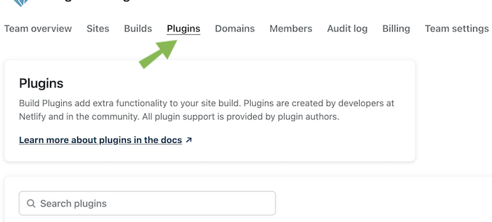

# Netlify build plugin for Qworum

This is the source code for a Netlify build plugin that checks whether Qworum is enabled for websites that are being deployed on Netlify. This plugin will allow Netlify's build process to complete only if the website is entitled to use Qworum.

## Installation

Install the Qworum plugin by selecting it in the `Plugins` tab from any team-level page on Netlify. Here is a direct link to the [Netlify build plugins directory](https://app.netlify.com/plugins).

## Why whould I want to enable Qworum for my website?

Qworum provides advanced web browser functionality that websites can use. If you don't enable Qworum for your website, then this functionality will not be available to your website.

Enabling Qworum for your website is FREE, and always will be.

## What is Qworum?

[Qworum](https://qworum.net/en/) is the _Service Web_ that enables modular and distributed web applications.

Qworum reduces the time and effort required for developing web applications considerably through modularity and third-party services. With Qworum, web applications can call remote full-page interactive services instead of implementing those interactive workflows themselves. You can also return the favor: any website can in turn also provide Qworum services to other websites.

∎
